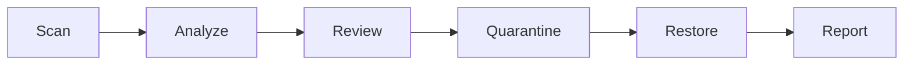
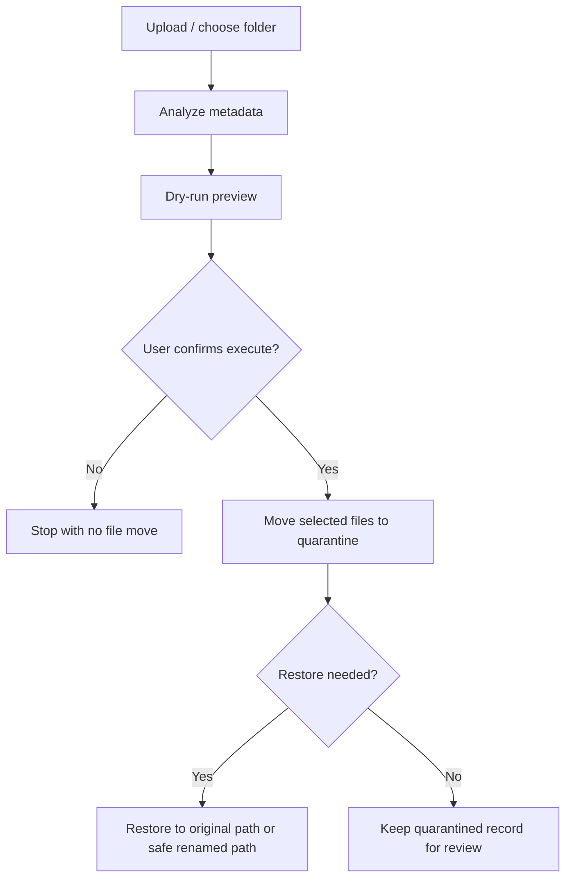

# Smart Organizer (v2.8.5rc10)

Smart Organizer is a local-first safe file organization assistant. It helps users inspect uploads or a local folder, explain why files may need attention, preview a reversible action, move selected files into quarantine, restore them later, and export a report.

The Streamlit UI now includes centralized i18n support for `zh-TW` and `en`, with `zh-TW` as the default interface language.

It is not an auto-delete tool, background cleanup daemon, chatbot, RAG app, or document QA system.

## What Problem It Solves

Messy download folders and mixed personal archives are hard to review safely. Smart Organizer focuses on a narrower but more trustworthy workflow:

- inspect files locally
- classify them with explainable rules
- preview the proposed move before execution
- quarantine instead of deleting
- restore without overwriting an existing user file
- export a report for audit or portfolio review

Supported upload formats: `pdf, jpg, jpeg, png, mp4, mov, mkv, avi, webm, m4v`.

Upload limits:

- single file: `25 MB`
- per batch: `50 MB`

## Recommended Python Version

- Recommended: Python `3.11`
- Supported and validated: Python `3.11`, `3.12`
- Unsupported versions fail preflight at startup and release validation. Python `3.10` and `3.13+` are not supported.

## Core Workflow



## Project Highlights

- Local-first safety model: review signals before any move, quarantine instead of delete, and keep restore available.
- Explainable organization: stale-file heuristics, duplicate-name detection, topic classification, and audit-friendly reports.
- Resilient degraded fallback: missing `ffmpeg`, `poppler`, or `tesseract` should reduce optional capabilities, not crash the app.
- Portfolio-ready engineering hygiene: typed Python, targeted tests, coverage gating, dependency audit, and CI coverage across Windows/Linux on Python `3.11` and `3.12`.

## Safe Organization Flow

Smart Organizer is designed around preview-first, reversible cleanup. It does not directly permanently delete selected user files.



Safety rules:

- User files are not directly permanently deleted by the organizer flow.
- Cleanup actions move selected files into `.smart_organizer_quarantine/` first.
- Restore uses a safe target path and avoids overwriting a newer user file.
- Quarantine state is tracked through `manifest.json`, written atomically via temp file + flush + `fsync` + `os.replace`.
- Interrupted move recovery is handled on the next quarantine, restore, or list operation.
- Release packaging uses an explicit allowlist and rejects user data, caches, DB files, and temp folders.

Workflow summary:

- `scan`: inspect a local folder or uploaded file metadata first
- `dry-run`: preview the exact quarantine path and operation summary
- `execute`: move only selected candidates into quarantine after confirmation
- `quarantine`: hold moved files in a reversible safety area with manifest tracking
- `restore`: return files to the original path or a collision-safe renamed path

## Duplicate Classification

Folder scan duplicate detection is intentionally conservative. Smart Organizer separates duplicate signals into three buckets:

- `same_content_duplicate`: same size and same hash. This is the highest-confidence duplicate signal.
- `same_name_candidate`: same filename appears in multiple folders, but content may differ.
- `similar_name_candidate`: filename is only similar. This is a review hint, not proof of duplication.

Important safety note:

- Similar names do not trigger automatic deletion.
- Duplicate classification is only used to improve dry-run review, quarantine explanations, and reports.
- Users still review the dry-run before any quarantine move.

## Repository, Quarantine, And Restore Logic

- `uploads/`: temporary upload staging area used before a record is finalized
- `repo/`: organized repository output grouped by normalized date folders
- `.smart_organizer_quarantine/`: reversible holding area for folder-cleanup moves
- `restore`: returns quarantined files to the original path when possible, or a safe renamed path when a collision exists

This means Smart Organizer preserves a review trail and a recovery path instead of silently removing data.

This project is intentionally a safe organization assistant, not a direct file deletion utility.

## SQLite Targets And Path Identity

Smart Organizer accepts both physical SQLite files and SQLite connection targets:

- relative and absolute database paths
- Windows paths, spaces, and Unicode paths
- `:memory:`
- shared-memory SQLite URIs such as `file:smart_organizer_memdb_<id>?mode=memory&cache=shared`

Schema inspection and schema upgrade treat SQLite URIs and `:memory:` as database targets instead of filesystem paths. Physical existence checks remain strict for real on-disk databases only.

SQLite connection ownership is explicit:

- `connect_sqlite(...)` returns an open caller-owned connection.
- `open_sqlite(...)` owns and closes a short-lived connection in `finally`.
- Helpers that accept an existing `sqlite3.Connection` borrow it and do not close it.
- `StorageManager` keeps its shared-memory keepalive connection open until `StorageManager.close()`, and `close()` is idempotent.

For file selection and quarantine flows, Smart Organizer preserves the original display path for UI/reporting while using one canonical internal path key for dictionary/set membership, selected-record lookup, duplicate maps, quarantine lookup, and manifest-lock ownership. This keeps Windows short-path, long-path, case-only, slash, and `.` / `..` aliases aligned without weakening containment or symlink safety.

## Quick Start

```bash
python -m pip install -r requirements.lock.txt
streamlit run app.py
```

The Streamlit home tab uses a compact `100vh` dashboard layout on desktop widths. Help, safety rules, workflow notes, warning details, report preview, and stats are available from dialog buttons instead of expanding the main page. On smaller screens the layout falls back to normal scrolling so the UI remains usable.

## Run In VS Code

In the source repository, VS Code can launch the Streamlit app directly:

1. Open the project folder in VS Code.
2. Select a Python interpreter with the required dependencies installed.
3. Install dependencies if needed:

```bash
python -m pip install -r requirements.lock.txt
```

4. Press `F5` and choose `Smart Organizer: Streamlit App`.
5. Open `http://localhost:8501` if the browser does not open automatically.

Using the VS Code launch target starts Streamlit directly. The home view opens with the compact dashboard layout, and the top dialog buttons contain the longer explanatory content.

The `.vscode/launch.json`, `.vscode/tasks.json`, and `.vscode/extensions.json` files are source-repository helpers and are not included in the runtime release zip.

## Runtime Data Location

Smart Organizer stores runtime user data outside the source directory by default:

- Windows: `%LOCALAPPDATA%\SmartOrganizer`
- Linux: `~/.local/share/smart-organizer`
- macOS: `~/Library/Application Support/SmartOrganizer`

Set `SMART_ORGANIZER_DATA_DIR` to use a different writable data directory. The runtime layout contains `smart_organizer.db`, `uploads/`, `repository/`, `previews/`, `quarantine/`, `logs/`, and `manifests/`. `StartupState.config` is the single runtime path source used by startup validation, migration, and service construction.

Legacy source-adjacent data is copied conservatively on first startup when the destination is clean; the old source data is left in place as a retained legacy backup. Migration first prepares a complete tree under `<destination-parent>/.smart-organizer-migration-<id>/prepared-data/`, writes `migration-state.json` atomically with temp-file + `fsync` + `os.replace`, verifies the SQLite backup and copied artifacts, and only then promotes the prepared tree. Destructive staging cleanup derives the authorized staging directory from the resolved `migration-state.json` location, rejects serialized path mismatches and symlink escapes, and never deletes outside the runtime data parent. A separate `.smart-organizer-migration.lock` prevents concurrent migrations and records PID, hostname, creation time, and an owner token for diagnostics; stale local locks are removed only after the PID is no longer active, while remote or malformed locks require manual recovery.

If startup is interrupted during preparation or verification, the next startup resumes or safely rebuilds only known staging data. If promotion was interrupted after the prepared tree was renamed, Smart Organizer verifies the destination-side promotion identity, database integrity, schema version, required directories, and marker state before finalizing; failed verification enters manual recovery without overwriting the destination or deleting legacy data. Completed migrations write and strictly validate `.smart_organizer_migration.json` fields including migration ID, legacy root, destination root, timestamps, `database_source`, schema version, database verification, and migrated artifact names. Repeated startup after a valid completed migration succeeds even though legacy source data remains; the preserved source is treated as a retained backup, not as an active conflict. Unknown non-empty destinations, corrupted databases, invalid markers, remote locks, conflicting active staging, and failed promotion verification produce a safe startup error instead of silent reuse.

Directory-only legacy data is supported by creating a new valid runtime database in staging before promotion. The completed marker records `database_source = newly_created`; normal SQLite backups record `database_source = migrated`. Legacy `repo/` and `repository/` directories are merged into canonical `repository/`: one non-empty source is used directly, distinct files from both sources are preserved, identical duplicate relative paths are deduplicated, and conflicting relative paths stop migration before promotion. Quarantine, manifests, logs, previews, uploads, and repository artifacts are migrated by explicit name mapping; source code, tests, caches, virtual environments, release zips, and other developer-only artifacts are excluded.

## Optional ClamAV Malware Scan

Smart Organizer can optionally call a local ClamAV installation before you organize candidate files. This is an integration point for a local antivirus scanner, not a replacement for antivirus software.

- ClamAV is an external optional dependency and is not bundled into the runtime zip.
- If `clamscan` is missing, candidate rows show `Scanner unavailable` instead of pretending files are clean.
- If `freshclam` is missing, Smart Organizer can still scan with ClamAV, but the UI cannot update virus databases for you.
- Smart Organizer never uploads files to cloud scanners, never executes suspicious files, and never deletes infected files automatically.
- Files marked `infected` by ClamAV are blocked from preview-to-move execution, quarantine moves, and restore flows inside Smart Organizer.

Typical local verification commands:

```bash
clamscan --version
freshclam
clamscan --no-summary path/to/file
```

Install ClamAV using the official package for your operating system so that both `clamscan` and `freshclam` are available on `PATH`. If `freshclam` fails because of permissions, networking, or firewall rules, resolve it with the official ClamAV guidance on that machine and then retry the manual update button in Smart Organizer.

## Demo Dataset

```bash
python scripts/create_demo_folder.py
streamlit run app.py
```

Then scan the generated `demo_files` folder. It contains old, recent, keep-focused, and duplicate-name examples so reviewers can experience the flow in about one minute. Re-running the command is safe: it creates any missing demo files but preserves existing user-edited files.

Preview the demo setup without writing files:

```bash
python scripts/create_demo_folder.py --dry-run
```

## Screenshots And Demo Placeholder

This repository does not currently bundle screenshot assets. To avoid fake portfolio artifacts, the README keeps this as a placeholder section.

Recommended screenshots to capture locally:

1. Upload or folder scan screen with explainable candidate reasons
2. Dry-run preview showing the exact target path before execution
3. Quarantine result showing `.smart_organizer_quarantine/<operation_id>/...`
4. Restore result showing collision-safe restore behavior
5. Records or exported report view

Suggested capture flow:

```bash
python scripts/create_demo_folder.py
streamlit run app.py
```

## Why It Is Safe

- No direct permanent delete in the main organization workflow
- Preview before move
- Path containment checks for scan, quarantine, and restore
- Atomic manifest persistence
- Recovery logic for interrupted move states
- Partial / degraded fallback for optional PDF, image, and video tooling

## Upload And Media Fallback Contract

- Upload validation rejects obviously invalid PDF and image signatures before analysis.
- Video uploads are accepted by extension and then validated during analysis.
- Fake video containers are reported as degraded results instead of crashing the batch.
- Missing `ffmpeg` or `ffprobe` falls back to partial video metadata with clear warnings.
- Missing PDF preview / OCR dependencies falls back to notes instead of aborting analysis.
- Corrupt image OCR or metadata reads return a conservative fallback result.

## Quality Gates

Run the same core checks used for local release confidence:

```bash
python -m ruff check --no-cache .
python -m mypy --cache-dir=/dev/null
python -m pytest -q
```

GitHub Actions validates Ubuntu and Windows on Python `3.11` and `3.12`.
For the full source-repository validation flow, including cache-safe compilation and release packaging, follow `RUN_RELEASE.md` from the source repository before packaging an official release.

## Source Repository Release Validation

Source repository only, not included in runtime release zip. The extracted runtime zip is for running the app, not for packaging or source-repo validation. Use `RUN_RELEASE.md` from the source repository when you need the full validation and packaging workflow.

## Release Build And Verification

Release packaging and verification are source-repository workflows. Follow `RUN_RELEASE.md` when building or validating an official runtime zip.

## CI And Validation Commands

CI and local release validation cover compile, cache-safe compile, lock consistency, Ruff, Mypy, branch coverage with a 75% threshold, pip-audit, release packaging, release verification, command-plan validation, and full release-validation execution.

Dependency lock validation is intentionally split between cross-platform static checks, canonical seeded no-upgrade regeneration, and an explicit manual upgrade path. Canonical regeneration stays pinned to Windows plus Python `3.11`, while the Ubuntu/Windows test matrix installs from the committed locks and runs static checks only.

Newly published compatible packages should no longer break CI because canonical validation reuses the committed pins before regenerating temporary lock output. Exact source-repository commands, lock-diff interpretation, and the explicit upgrade workflow live in `RUN_RELEASE.md`. The runtime zip keeps that document for reference, but the validation scripts themselves remain source-only files.

Focused SQLite lifecycle validation command:

```bash
python -B -X tracemalloc=10 -W error::ResourceWarning -m pytest -q --tb=short -ra tests/test_storage_db_schema.py tests/test_runtime_config.py tests/test_storage.py tests/test_app_bootstrap.py
```

Dependabot checks Python dependencies and GitHub Actions weekly. CodeQL runs as supplemental security analysis for Python and workflow code.

The extracted runtime package is not the place to run those source-repository commands. Use `RUN_RELEASE.md` from the source repository for the exact command sequence and release-validation workflow.

The source release-validation wrapper keeps the command plan aligned with CI. Its `--timeout-tail-lines` option controls how many recent stdout/stderr lines are shown when a validation subprocess times out, including flushed partial lines when available.

## Portfolio Highlights

- Safe folder organization workflow
- Reversible quarantine and restore manifest
- Explainable rule-based scoring
- Streamlit smoke tests without browser E2E dependency
- Release packaging with allowlist verification
- One-command demo dataset generator

## Known Limitations

- Access time (`atime`) can be unreliable on some filesystems and OS settings.
- Modified time (`mtime`) and file size are supporting signals, not proof that a file is safe to archive.
- OCR, PDF preview, and video metadata depend on optional system tools.
- The main product flow is synchronous for predictability and simpler recovery behavior.
- The app does not automatically delete selected user files.

## Additional Docs

- Architecture and tradeoffs: `docs/PORTFOLIO_CASE_STUDY.md`
- Known limitations: `docs/KNOWN_LIMITATIONS.md`
- Release packaging notes: `RELEASE_PACKAGING.md`
- Release runbook: `RUN_RELEASE.md`
- Traditional Chinese quick start: `README.zh-TW.md`
If a browser or Streamlit session closes after upload analysis but before final organization, the unfinished upload remains recoverable from **Search & Records > Maintenance > Unfinished Uploads**. Use **Resume** to restore persisted review data when available, **Re-analyze** to rebuild analysis from the saved temporary upload, or **Discard** to remove the unfinished database row and approved temporary artifacts. If the temporary file is missing, the record is marked broken and can still be discarded safely.
