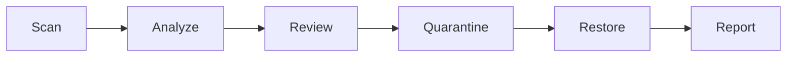
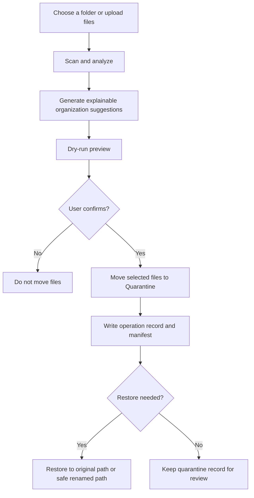

# Smart Organizer (v2.8.4)

Smart Organizer is a local-first safe file organization assistant. It is not an automatic delete tool, knowledge base, RAG system, chatbot, or document QA app.

The core product promise is simple: scan a folder, explain why files may need review, move selected files into quarantine, restore them if needed, and export a report.

Supported upload formats: `pdf, jpg, jpeg, png, mp4, mov, mkv, avi, webm, m4v`.

Time policy:

- Database records use UTC ISO 8601 timestamps.
- Folder scan and quarantine manifests use UTC ISO 8601 timestamps.
- The Streamlit UI renders record timestamps in local time for easier review.
- Exported records and folder reports label timestamps as UTC.

## Core Workflow



Folder organizer flow:

1. Scan a local folder with metadata-only inspection.
2. Dry-run the selected cleanup actions before any move happens.
3. Execute only the user-confirmed move operation.
4. Move selected files into `.smart_organizer_quarantine/`.
5. Restore quarantined files without overwriting existing files.
6. Export Markdown or CSV reports.

## Safety Design

- No direct delete of selected user files: cleanup actions move selected files to quarantine first.
- Path containment: scan, quarantine, and restore paths are validated against the selected root.
- Restore protection: restore uses a safe destination and does not overwrite a new user file.
- Atomic manifest: `manifest.json` is saved through `manifest.json.tmp`, flush, `fsync`, and `os.replace`.
- Interrupted move recovery: `MOVING` manifest entries are repaired on the next quarantine/restore/list operation.
- Release allowlist: the runtime zip is built from explicit files and rejects caches, DBs, uploads, temp folders, and `.git`.

## Safe Organization Flow

Smart Organizer is designed around preview-first, reversible cleanup. It does not directly delete selected user files.



Release packaging follows the same safety boundary: generated runtime zips are built from an explicit allowlist and must not include local user data, SQLite DB files, `uploads/`, `repo/`, caches, virtual environments, or release temp extraction folders.

## Quick Demo

```bash
python -m pip install -r requirements.txt
python scripts/create_demo_folder.py
streamlit run app.py
```

Then scan the generated `demo_files` folder. It contains old, suspected duplicate-name, recent, and keep-focused sample files so reviewers can experience the full flow in about one minute.

Recommended demo screenshots for a portfolio or interview walkthrough:

1. Folder scan results showing candidate reasons, risk labels, and recommendations.
2. Dry-run preview showing the exact quarantine target path before any move happens.
3. Quarantine result showing `.smart_organizer_quarantine/<operation_id>/...`.
4. Restore result showing files returned without overwriting existing user files.
5. Exported Markdown or CSV report preview.

If quarantine metadata access is blocked by a leftover `manifest.json.lock`, Smart Organizer raises a clear manifest-lock error. It does not silently hang, and it does not auto-delete the lock file because that could conflict with another active process.

## Upload And Video Contract

- Upload validation rejects obviously invalid PDF and image signatures before analysis.
- Video uploads are accepted by extension and then validated during analysis.
- If a file is named like a video but the container signature does not match, the analysis is kept as a degraded video result instead of crashing the batch.
- If `ffmpeg` or `ffprobe` is missing, video analysis falls back to partial metadata with clear warnings and no guaranteed thumbnail.
- Unsupported file extensions are rejected at upload time.

This means a fake `.mp4` is not silently treated as a healthy video, but it is also not allowed to take down the review flow.

## Explainable Scoring

The organizer is intentionally rule-based and reproducible. Each scan record includes:

- `confidence`
- `risk_level`
- `candidate_reasons`
- `reason_codes`
- `file_age_score`
- `size_score`
- `duplicate_score`
- `extension_risk_score`

Low-confidence items are marked for manual review or do-not-touch handling. The app does not use opaque AI decisions for quarantine recommendations.

## Known Limitations

- Access time (`atime`) can be unreliable on some filesystems and OS settings.
- Modified time (`mtime`) and file size are supporting signals, not proof that a file is safe to archive.
- Users must manually confirm before moving files.
- OCR, PDF preview, and video metadata depend on optional system tools.
- Async batch upload processing exists as an internal or future-use implementation path. The main demo and supported UI flow use the synchronous path for clearer progress and safer error handling.
- The app does not automatically delete selected user files.
- Internal temp files, previews, and caches may be cleaned up by maintenance routines.

## Portfolio Highlights

- Safe folder organization workflow
- Quarantine and restore manifest
- Atomic manifest write and recovery tests
- Streamlit UI flow tests with `tmp_path` demo files
- Explainable rule scoring
- Release packaging with allowlist verification
- One-command demo dataset generator

## Additional Docs

- Architecture and tradeoffs: `docs/PORTFOLIO_CASE_STUDY.md`
- Known limitations: `docs/KNOWN_LIMITATIONS.md`
- Release packaging notes: `RELEASE_PACKAGING.md`
- Release runbook: `RUN_RELEASE.md`

## Local Validation

Source-repository validation lives in the release runbook. Use `RUN_RELEASE.md` as the single source of truth for release-confidence and local verification commands.
