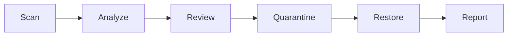
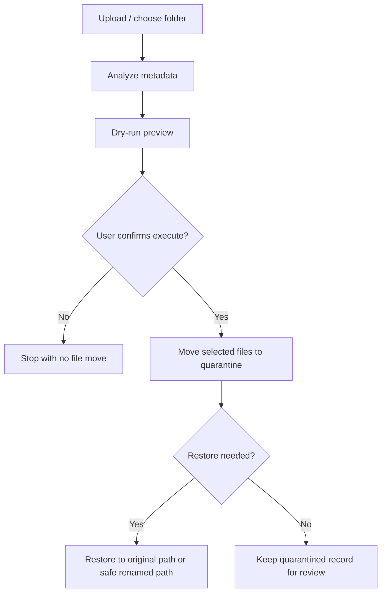

# Smart Organizer (v2.8.4)

Smart Organizer is a local-first safe file organization assistant. It helps users inspect uploads or a local folder, explain why files may need attention, preview a reversible action, move selected files into quarantine, restore them later, and export a report.

It is not an auto-delete tool, background cleanup daemon, chatbot, RAG app, or document QA system.

## What Problem It Solves

Messy download folders and mixed personal archives are hard to review safely. Smart Organizer focuses on a narrower but more trustworthy workflow:

- inspect files locally
- classify them with explainable rules
- preview the proposed move before execution
- quarantine instead of deleting
- restore without overwriting an existing user file
- export a report for audit or portfolio review

Supported upload formats: `pdf, jpg, jpeg, png, mp4, mov, mkv, avi, webm, m4v`.

## Recommended Python Version

- Recommended: Python `3.11`
- Supported and validated in CI: Python `3.11`, `3.12`, `3.13`

## Core Workflow



## Safe Organization Flow

Smart Organizer is designed around preview-first, reversible cleanup. It does not directly permanently delete selected user files.



Safety rules:

- User files are not directly permanently deleted by the organizer flow.
- Cleanup actions move selected files into `.smart_organizer_quarantine/` first.
- Restore uses a safe target path and avoids overwriting a newer user file.
- Quarantine state is tracked through `manifest.json`, written atomically via temp file + flush + `fsync` + `os.replace`.
- Interrupted move recovery is handled on the next quarantine, restore, or list operation.
- Release packaging uses an explicit allowlist and rejects user data, caches, DB files, and temp folders.

## Repository, Quarantine, And Restore Logic

- `uploads/`: temporary upload staging area used before a record is finalized
- `repo/`: organized repository output grouped by normalized date folders
- `.smart_organizer_quarantine/`: reversible holding area for folder-cleanup moves
- `restore`: returns quarantined files to the original path when possible, or a safe renamed path when a collision exists

This means Smart Organizer preserves a review trail and a recovery path instead of silently removing data.

## Quick Start

```bash
python -m pip install -r requirements.txt
streamlit run app.py
```

## Demo Dataset

```bash
python scripts/create_demo_folder.py
streamlit run app.py
```

Then scan the generated `demo_files` folder. It contains old, recent, keep-focused, and duplicate-name examples so reviewers can experience the flow in about one minute. Re-running the command is safe: it creates any missing demo files but preserves existing user-edited files.

Preview the demo setup without writing files:

```bash
python scripts/create_demo_folder.py --dry-run
```

## Screenshots And Demo Placeholder

This repository does not currently bundle screenshot assets. To avoid fake portfolio artifacts, the README keeps this as a placeholder section.

Recommended screenshots to capture locally:

1. Upload or folder scan screen with explainable candidate reasons
2. Dry-run preview showing the exact target path before execution
3. Quarantine result showing `.smart_organizer_quarantine/<operation_id>/...`
4. Restore result showing collision-safe restore behavior
5. Records or exported report view

Suggested capture flow:

```bash
python scripts/create_demo_folder.py
streamlit run app.py
```

## Why It Is Safe

- No direct permanent delete in the main organization workflow
- Preview before move
- Path containment checks for scan, quarantine, and restore
- Atomic manifest persistence
- Recovery logic for interrupted move states
- Partial / degraded fallback for optional PDF, image, and video tooling

## Upload And Media Fallback Contract

- Upload validation rejects obviously invalid PDF and image signatures before analysis.
- Video uploads are accepted by extension and then validated during analysis.
- Fake video containers are reported as degraded results instead of crashing the batch.
- Missing `ffmpeg` or `ffprobe` falls back to partial video metadata with clear warnings.
- Missing PDF preview / OCR dependencies falls back to notes instead of aborting analysis.
- Corrupt image OCR or metadata reads return a conservative fallback result.

## Source Repository Release Validation

Source repository only, not included in runtime release zip. The extracted runtime zip is for running the app, not for packaging or source-repo validation. Use `RUN_RELEASE.md` from the source repository when you need the full validation and packaging workflow.

## Release Build And Verification

Release packaging and verification are source-repository workflows. Follow `RUN_RELEASE.md` when building or validating an official runtime zip.

## Portfolio Highlights

- Safe folder organization workflow
- Reversible quarantine and restore manifest
- Explainable rule-based scoring
- Streamlit smoke tests without browser E2E dependency
- Release packaging with allowlist verification
- One-command demo dataset generator

## Known Limitations

- Access time (`atime`) can be unreliable on some filesystems and OS settings.
- Modified time (`mtime`) and file size are supporting signals, not proof that a file is safe to archive.
- OCR, PDF preview, and video metadata depend on optional system tools.
- The main product flow is synchronous for predictability and simpler recovery behavior.
- The app does not automatically delete selected user files.

## Additional Docs

- Architecture and tradeoffs: `docs/PORTFOLIO_CASE_STUDY.md`
- Known limitations: `docs/KNOWN_LIMITATIONS.md`
- Release packaging notes: `RELEASE_PACKAGING.md`
- Release runbook: `RUN_RELEASE.md`
