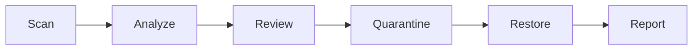
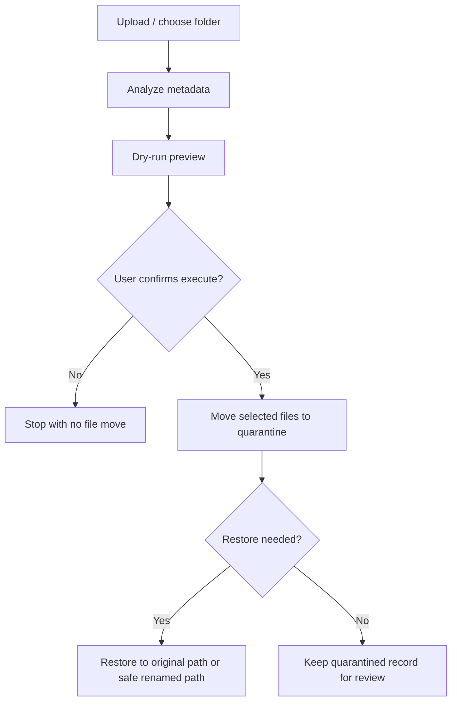

# Smart Organizer (v2.8.4)

Smart Organizer 是一個以本機優先為核心的安全檔案整理助手。它能協助你檢視上傳檔案或本機資料夾、說明哪些檔案值得注意、先做 dry-run 預覽，再把你選擇的檔案移入 quarantine，之後也能安全還原並匯出報告。

目前 Streamlit UI 已集中支援 `zh-TW` 與 `en`，預設語言為 `zh-TW`。

它不是自動刪檔工具、背景清理 daemon、聊天機器人、RAG app，也不是文件 QA 系統。

## 它解決什麼問題

下載資料夾與混合式檔案庫很容易失控，但直接清空風險太高。Smart Organizer 聚焦在一條更保守、也更值得信任的流程：

- 只在本機檢查檔案
- 用可解釋規則分類
- 執行前先預覽目標動作
- 用 quarantine 取代直接刪除
- 還原時避免覆蓋既有檔案
- 匯出報告供稽核或作品集展示

支援的上傳格式：`pdf, jpg, jpeg, png, mp4, mov, mkv, avi, webm, m4v`。

上傳限制：

- 單一檔案最大 `25 MB`
- 單次批次上傳總容量最大 `50 MB`

## 建議 Python 版本

- 建議：Python `3.11`
- CI 已驗證：Python `3.11`、`3.12`、`3.13`

## 核心流程



## 專案亮點

- 安全優先：`scan -> dry-run -> execute -> quarantine -> restore` 全流程都以可逆操作為前提。
- 可解釋：以明確規則產生分類、候選原因、duplicate 訊號與匯出報表，不靠黑箱刪檔。
- 降級不當機：缺少 `ffmpeg`、`poppler`、`tesseract` 時，功能會退化並提示，但不應讓整個 app 崩潰。
- 工程品質：以型別檢查、測試、CI 與 source-repository release validation 維持穩定性。

## 安全整理流程

Smart Organizer 以 preview-first、可逆整理為核心。它不會直接永久刪除使用者選擇的檔案。



安全規則：

- 主流程不直接永久刪除使用者檔案
- 清理動作會先把選定檔案移到 `.smart_organizer_quarantine/`
- 還原使用安全路徑，避免覆蓋較新的使用者檔案
- quarantine 狀態透過 `manifest.json` 追蹤，並以 temp file + flush + `fsync` + `os.replace` 原子寫入
- 中斷搬移的復原會在下次 quarantine、restore 或 list 時自動處理
- release packaging 採 allowlist，會拒絕使用者資料、cache、DB 檔與暫存資料夾

流程摘要：

- `scan`：先掃描資料夾或上傳檔案的 metadata
- `dry-run`：先預覽整理後路徑與結果摘要
- `execute`：只有在使用者確認後才真的移動檔案
- `quarantine`：所有整理動作都先進 `.smart_organizer_quarantine/`
- `restore`：需要時可還原到原路徑，若撞名則安全改名

這代表 Smart Organizer 是安全整理助理，不是直接刪除使用者檔案的工具。

## Duplicate 判定

資料夾掃描的 duplicate detection 採保守策略，會把訊號分成三類：

- `same_content_duplicate`：檔案大小相同，且 hash 也相同。這是最高信心的重複訊號。
- `same_name_candidate`：不同資料夾出現相同檔名，但內容可能不同。
- `similar_name_candidate`：檔名只是相似，屬於提醒訊號，不代表內容真的重複。

重要安全說明：

- 相似檔名不會觸發自動刪除
- duplicate classification 只用來改善 dry-run 預覽、quarantine 說明與報告內容
- 最後仍由使用者審核 dry-run 再決定是否移動

## Repository、Quarantine 與 Restore

- `uploads/`：檔案完成整理前的暫存上傳區
- `repo/`：依標準化日期分組的整理後輸出
- `.smart_organizer_quarantine/`：資料夾清理動作的可逆暫存區
- `restore`：可把 quarantined 檔案還原到原路徑，若撞名則改為安全新名稱

## 快速開始

```bash
python -m pip install -r requirements.txt
streamlit run app.py
```

Streamlit 首頁在桌機寬度下會使用精簡的 `100vh` dashboard 版面。使用說明、安全規則、操作流程、掃描警告、報表預覽與統計明細都移到上方對話視窗按鈕中；若螢幕較小，版面會自動退回一般可捲動模式。

## 在 VS Code 用 F5 啟動

在 source repository 中，VS Code 可以直接啟動 Streamlit app：

1. 用 VS Code 開啟整個專案資料夾。
2. 選擇已安裝必要依賴的 Python interpreter。
3. 如果需要，先安裝依賴：

```bash
python -m pip install -r requirements.txt
```

4. 按 `F5`，並選擇 `Smart Organizer: Streamlit App`。
5. 若瀏覽器沒有自動開啟，請手動前往 `http://localhost:8501`。

使用這個 VS Code 啟動設定時，會直接開啟 Streamlit。首頁預設採精簡 dashboard 版面，較長的說明內容則集中在上方的對話視窗按鈕中。

`.vscode/launch.json`、`.vscode/tasks.json`、`.vscode/extensions.json` 只存在於 source repository，不會放進 runtime release zip。

## 選配 ClamAV 木馬掃描

Smart Organizer 可以在整理候選檔案前，選擇性呼叫本機安裝的 ClamAV。這只是整合本機防毒掃描器，不是要把 Smart Organizer 做成防毒軟體。

- ClamAV 是外部選配相依，不會被打包進 runtime release zip。
- 若找不到 `clamscan`，候選檔案會顯示「掃描器不可用」，不會假裝檔案安全。
- 若找不到 `freshclam`，仍可用現有病毒碼掃描，但 Smart Organizer 無法替你更新病毒資料庫。
- Smart Organizer 不會把檔案上傳到雲端掃描，不會執行可疑檔案，也不會自動刪除感染檔案。
- 被 ClamAV 標記為 `infected` 的檔案，會被禁止進入 Smart Organizer 的搬移、隔離與還原流程。

建議的本機手動檢查指令：

```bash
clamscan --version
freshclam
clamscan --no-summary path/to/file
```

請依照作業系統使用 ClamAV 官方安裝方式，讓 `clamscan` 與 `freshclam` 都能在 `PATH` 上找到。若 `freshclam` 因權限、網路或防火牆失敗，請先依 ClamAV 官方方式處理主機環境，再回到 Smart Organizer 手動按「更新病毒資料庫」。

## Demo 資料集

```bash
python scripts/create_demo_folder.py
streamlit run app.py
```

接著掃描產生的 `demo_files` 資料夾。內容包含舊檔、近期檔案、應保留檔與 duplicate-name 範例，方便在一分鐘內走完流程。重複執行也安全：只會補齊缺漏 demo 檔，不會覆蓋使用者已修改的內容。

若只想預覽 demo 建立內容、不落地寫檔：

```bash
python scripts/create_demo_folder.py --dry-run
```

## 為什麼它是安全的

- 主流程不直接永久刪檔
- 搬移前一定先預覽
- scan、quarantine、restore 都有 path containment 檢查
- manifest 採原子寫入
- 中斷搬移有 recovery 邏輯
- PDF、OCR、video 等可選依賴都走 degraded fallback

## 品質檢查

本機開發時可先執行核心檢查：

```bash
python -m ruff check --no-cache .
python -m mypy --cache-dir=/dev/null
python -m pytest -q
```

完整 source-repository release validation、cache-safe compile、打包與驗證流程請依照 source repository 中的 `RUN_RELEASE.md` 執行。

## Upload 與多媒體 fallback 合約

- 上傳驗證會先拒絕明顯錯誤的 PDF 與圖片 signature
- 影片上傳先依副檔名接受，再於分析階段驗證
- 假影片容器會回報 degraded 結果，而不是讓整批分析崩潰
- 缺少 `ffmpeg` 或 `ffprobe` 時，會回退為部分影片 metadata 與清楚警告
- 缺少 PDF preview / OCR 依賴時，會以 note 方式降級而不是中止分析
- 圖片 OCR 或 metadata 讀取失敗時，會回傳保守 fallback 結果

## Source Repository Release Validation

這是 source repository 專用流程，不會包含在 runtime release zip 內。解壓後的 runtime zip 是給執行 app 用的，不是給 packaging 或 source-repo validation 用的。需要完整驗證與打包流程時，請在 source repository 中參考 `RUN_RELEASE.md`。

## Release Build 與驗證

release packaging 與 verification 都屬於 source-repository workflow。請依照 `RUN_RELEASE.md` 執行官方 runtime zip 的建置與驗證。

## CI 與驗證指令

CI 與本機 release validation 會涵蓋 compile、cache-safe compile、lint、type checking、tests、release packaging、release verification、command-plan validation，以及完整 release-validation workflow。

解壓後的 runtime package 不適合執行這些 source-repository 指令。請在 source repository 中依 `RUN_RELEASE.md` 的指令順序操作。

source release-validation wrapper 會讓 command plan 與 CI 保持一致，`--timeout-tail-lines` 參數則可控制 subprocess timeout 時要印出多少最近 stdout/stderr 行數，包含已 flush 的 partial line。

## 其他文件

- 英文 README：`README.md`
- 架構與取捨：`docs/PORTFOLIO_CASE_STUDY.md`
- 已知限制：`docs/KNOWN_LIMITATIONS.md`
- Release packaging 說明：`RELEASE_PACKAGING.md`
- Release runbook：`RUN_RELEASE.md`
- i18n 實作：`i18n.py`
- 繁中語系：`locales/zh-TW.json`
- 英文語系：`locales/en.json`
